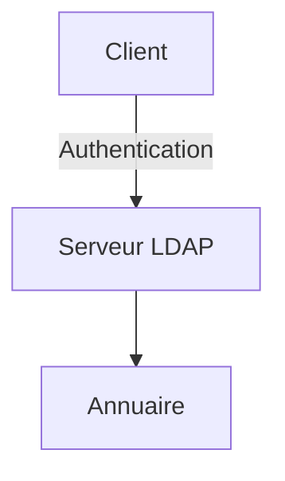

# Infrastructure LDAP - Identity & Access Management


Déploiement d’un annuaire LDAP permettant la **centralisation des identités**, la **gestion des accès** et la **sécurisation de l’authentification** dans un environnement Linux.

---

## Résumé exécutif

Implémentation d’une solution **LDAP (OpenLDAP)** pour remplacer la gestion locale des comptes par une **authentification centralisée**, alignée avec les pratiques utilisées en entreprise (Active Directory / IAM).

Ce projet met l’accent sur :

* la structuration d’un annuaire
* la gestion des identités
* la sécurisation des accès systèmes

---

## Périmètre technique

* OS : Debian / Ubuntu
* Service : OpenLDAP
* Authentification centralisée (PAM / NSS possible)
* Gestion utilisateurs & groupes

---

## Réalisations clés

* Déploiement complet d’un serveur **OpenLDAP**
* Conception d’un **DIT (Directory Information Tree)** cohérent
* Création et gestion d’utilisateurs LDAP
* Centralisation de l’authentification système
* Tests d’intégration avec les services Linux
* Validation fonctionnelle via commandes LDAP

---

## Architecture



---

## Modélisation de l’annuaire

```text
dc=entreprise,dc=local
│
├── ou=users
│   ├── uid=user1
│   ├── uid=user2
│
├── ou=groups
```

---

## Exemple d’entrée (LDIF)

```ldif
dn: uid=user1,ou=users,dc=entreprise,dc=local
objectClass: inetOrgPerson
uid: user1
cn: User One
sn: One
mail: user1@entreprise.local
```

---

## Sécurité implémentée

* Centralisation des identités
* Suppression de la gestion locale des comptes
* Authentification unifiée
* Réduction des risques liés aux comptes multiples
* Préparation à l’intégration TLS (LDAPS)

---

## Tests et validation

* Recherche LDAP :

```bash
ldapsearch -x
```

* Authentification utilisateur
* Vérification des entrées et attributs
* Tests d’accès système

---

## Compétences démontrées

* Identity & Access Management (IAM)
* Administration Linux
* Configuration OpenLDAP
* Structuration d’un annuaire
* Authentification centralisée
* Analyse et validation système

---

## Limites

* Architecture mono-serveur
* Pas de réplication LDAP
* Pas de chiffrement activé par défaut (LDAPS)
* ACL avancées non implémentées

---

## Perspectives d’amélioration

* Implémentation de **LDAPS (TLS)**
* Mise en place d’ACL fines
* Intégration avec PAM/NSS
* Interconnexion avec Active Directory
* Mise en place de réplication (HA)

---

## Valeur professionnelle

Projet directement aligné avec les environnements d’entreprise :

* gestion centralisée des utilisateurs
* base des infrastructures Active Directory
* fondations des systèmes IAM modernes

---

## Structure

```text
.
├── LDAP.pdf
└── README.md
```

---

## Documentation

Le fichier `LDAP.pdf` contient :

* les étapes complètes
* les configurations détaillées
* les validations réalisées

---

## Auteur

Alexis Noiret
Étudiant en cybersécurité
